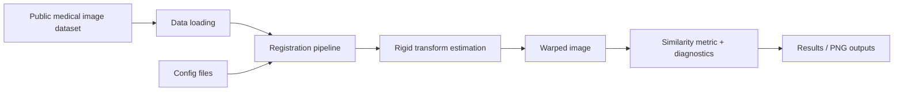

# Medical Image Registration Benchmark

A Python benchmarking framework for comparing classical and learning-based medical image registration methods on 3D medical datasets.

This project brings together affine and deformable registration approaches, evaluation metrics, and dataset tooling in a single reproducible pipeline. It is designed for research and experimentation in medical imaging, with a strong focus on clinically relevant image alignment tasks such as CT/CT and CT/MR registration.

This repository is useful for:

- benchmarking multiple registration methods under the same conditions
- comparing classical algorithms with deep learning approaches
- evaluating image alignment quality with medical metrics
- experimenting with deformable fields and displacement analysis
- building a reusable pipeline for imaging research or production prototypes

## Included methods

The benchmark includes multiple registration strategies, including:

- ANTs SyN
- NiftyReg affine and B-spline registration
- SimpleITK Demons
- corrField
- VoxelMorph
- LapIRN
- HyperMorph

## Repository structure

- `registrationbaselines/registration/` — method implementations and registration interfaces
- `registrationbaselines/data_loading/` — dataset loaders and pre-processing hooks
- `registrationbaselines/evaluation/` — metrics, plotting, CSV output, and result analysis
- `registrationbaselines/displacement/` — displacement field and deformation utilities
- `registrationbaselines/configs/` — YAML configs for registration methods
- `examples/` — runnable end-to-end scripts
- `registrationbaselines/tests/` — validation and regression checks
- `docs/` — project documentation notes


```bash
pip install -r requirements.txt
```

## Architecture and design overview



The project is built around a modular pipeline: dataset loaders feed image pairs into a shared registration interface, the deformation or displacement is computed, and the results are evaluated using consistent metrics and saved artifacts. This design makes the code easier to explain in interviews, easier to extend in research, and clearer as a real engineering workflow.

## Quick start

### 1. Create a virtual environment

```bash
python -m venv .venv
source .venv/bin/activate
```

### 2. Install dependencies

```bash
pip install -r requirements.txt
```

### 3. Run an example pipeline

```bash
python examples/fullPipeline.py
```

This example loads a dataset, runs a registration method, and evaluates the alignment quality.

## Example usage

```python
from pathlib import Path
from registrationbaselines.data_loading import data_loaders
from registrationbaselines.registration.demons_sitk import DemonsSITK

base_dir = Path(".")
config_path = base_dir / "registrationbaselines/configs/DemonsSITK.yaml"

loader = data_loaders.L2RLungCTDataset(
    Path("/path/to/dataset"),
    return_type="path_dict",
    indices=[0, 1],
)

registration = DemonsSITK(config_path, loader, use_masked_evaluation=True)
registration.evaluate_with_zero_displacement()
registration.execute_with_one_parameter_set()
```

## Data expectations

This project is built for medical imaging datasets in folder structures compatible with the included dataloaders. In the examples, datasets are passed as paths such as:

- Lung CT benchmarks
- abdominal CT/CT pairs
- MR/CT registration tasks

A working installation generally requires preprocessed NIfTI images and a dataset directory consistent with the loader definitions.

## Evaluation and benchmarking

The framework supports:

- quantitative comparison across registration algorithms
- displacement field inspection
- result plotting and CSV export
- mask-aware evaluation workflows
- zero-displacement baselines for sanity checks

## License

This project is distributed under the license found in the repository: `LICENSE`.


