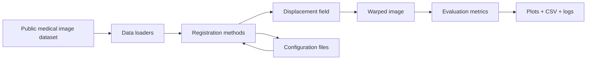

# Architecture overview

This project separates the full registration workflow into clear stages so each component can be benchmarked, reused, and debugged independently.

## Design overview

The framework is organized around a simple pipeline:

1. Data loading
   - Convert raw image pairs into a consistent dataset format.
   - Support public medical datasets such as MedMNIST as well as larger research datasets.

2. Registration method execution
   - Each method implements a common registration interface.
   - Algorithms can be classical optimization methods or learning-based models.

3. Deformation and displacement utilities
   - Capture the geometric transform that aligns moving images to fixed images.
   - Store and inspect displacement fields for analysis and debugging.

4. Evaluation and benchmarking
   - Measure alignment quality with task-specific metrics and masks.
   - Compare methods under the same dataset and evaluation conditions.

5. Results and reporting
   - Save transformed images, deformations, plots, and CSV summaries.
   - Support experiment logging and reproducible comparisons.

## High-level architecture

## Why this structure works

This layout keeps the project recruiter-friendly and technically strong:

- each method follows the same interface
- evaluation is decoupled from registration logic
- dataset handling is isolated from model implementation
- results are reproducible and comparable across algorithms

That makes the code easier to explain in interviews, easier to extend in research, and easier to present as a real engineering pipeline.
